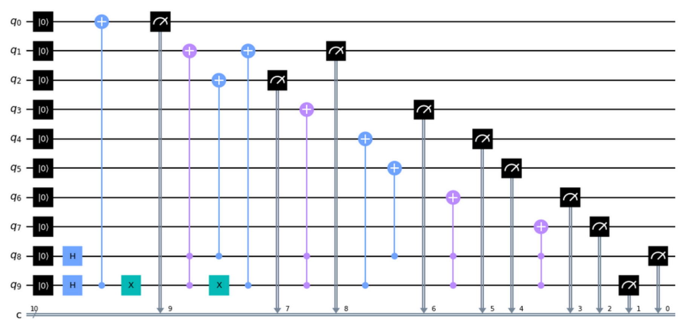

# NEQR-examples
NEQR Quantum Image Representation Examples in Qiskit

See the paper:
Zhang, Y., Lu, K., Gao, Y. et al. NEQR: a novel enhanced quantum representation of digital images. Quantum Inf Process 12, 2833–2860 (2013). https://doi.org/10.1007/s11128-013-0567-z

PDF available here:
https://www.researchgate.net/publication/257641933_NEQR_A_novel_enhanced_quantum_representation_of_digital_images

NEQR_example_4_pixel_8bpp.py
The example from the paper with 4 pixels of 8 bits per pixel grayscale

